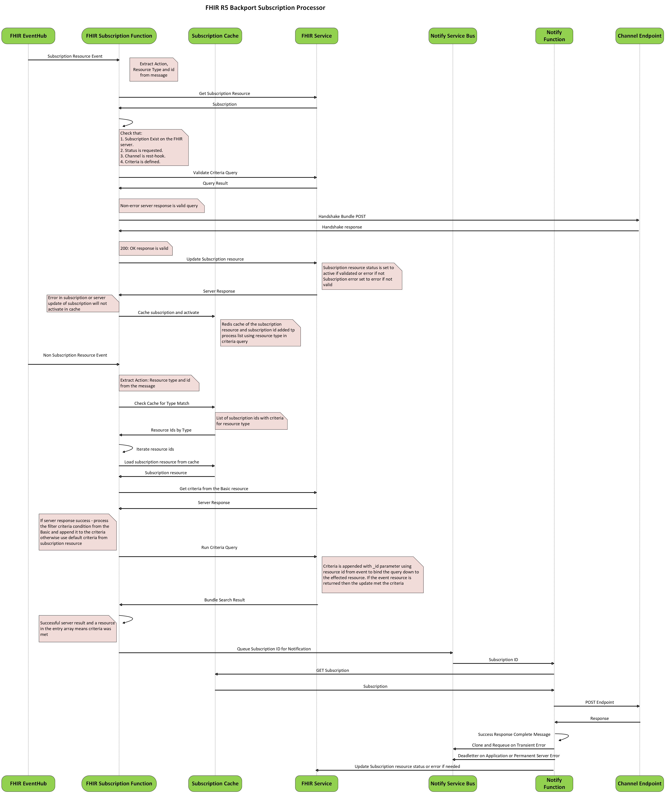

# FHIR R5 Backport Subscription Processor

FHIR Subscription Processor is an Azure Function App solution that provides support for creation and monitoring of [FHIR R5 backport Subscription resources](https://hl7.org/fhir/uv/subscriptions-backport/2024Jan/components.html) Features include:
 + Validation of Criteria and Activation of Subscription Monitoring upon Subscription Resource Create/Modify 
 + Support for rest-hook callback notifications
 + Complete Auditing, Error logging and Retry for rest-hook notifications 

## R5 Backport Subscription Process Overview


## Simple Use Example
Let's say you want to monitor the patient who's encounter is completed via a population management application.  This population management application exposes a rest-hook endpoint that will trigger a refresh workflow for patients when called, this workflow may include updating population, reasessing population risk scores, etc... You want to trigger this endpoint when any Patient's encounter is completed in the FHIR Server. You would execute the following steps to acheive this:</br>
1. Using Postman or other HTTP Rest Client, Create a Basic resource to have topic base subscription on the FHIR Server. This Basic resource will have the resource trigger current condition in queryCriteria:

```
{
  "resourceType": "Basic",
  "extension": [
    {
      "url": "http://hl7.org/fhir/5.0/StructureDefinition/extension-SubscriptionTopic.url",
      "valueUri": "http://example.org/FHIR/SubscriptionTopic/encounter-complete"
    },
    {
      "url": "http://hl7.org/fhir/5.0/StructureDefinition/extension-SubscriptionTopic.version",
      "valueString": "1.0.0-fhir.r4"
    },
    {
      "url": "http://hl7.org/fhir/5.0/StructureDefinition/extension-SubscriptionTopic.name",
      "valueString": "Example Encounter Completed Topic"
    },
    {
      "url": "http://hl7.org/fhir/5.0/StructureDefinition/extension-SubscriptionTopic.title",
      "valueString": "encounter-complete"
    },
    {
      "url": "http://hl7.org/fhir/5.0/StructureDefinition/extension-SubscriptionTopic.date",
      "valueDateTime": "2019-01-01"
    },
    {
      "url": "http://hl7.org/fhir/5.0/StructureDefinition/extension-SubscriptionTopic.description",
      "valueMarkdown": "Example topic for completed encounters"
    },
    {
      "extension": [
        {
          "url": "description",
          "valueMarkdown": "An Encounter has been completed"
        },
        {
          "url": "resource",
          "valueUri": "http://hl7.org/fhir/StructureDefinition/Encounter"
        },
        {
          "url": "supportedInteraction",
          "valueCode": "create"
        },
        {
          "url": "supportedInteraction",
          "valueCode": "update"
        },
        {
          "extension": [
            {
              "url": "previous",
              "valueString": "status:not=finished"
            },
            {
              "url": "resultForCreate",
              "valueCode": "test-passes"
            },
            {
              "url": "current",
              "valueString": "status=finished"
            },
            {
              "url": "resultForDelete",
              "valueCode": "test-fails"
            },
            {
              "url": "requireBoth",
              "valueBoolean": true
            }
          ],
          "url": "queryCriteria"
        },
        {
          "url": "fhirPathCriteria",
          "valueString": "(%previous.id.empty() or (%previous.status != 'finished')) and (%current.status = 'finished')"
        }
      ],
      "url": "http://hl7.org/fhir/5.0/StructureDefinition/extension-SubscriptionTopic.resourceTrigger"
    },
    {
      "extension": [
        {
          "url": "description",
          "valueMarkdown": "Filter based on the subject of an encounter."
        },
        {
          "url": "resource",
          "valueUri": "Encounter"
        },
        {
          "url": "filterParameter",
          "valueString": "subject"
        }
      ],
      "url": "http://hl7.org/fhir/5.0/StructureDefinition/extension-SubscriptionTopic.canFilterBy"
    },
    {
      "extension": [
        {
          "url": "description",
          "valueMarkdown": "Filter based on the group membership of the subject of an encounter."
        },
        {
          "url": "resource",
          "valueUri": "Encounter"
        },
        {
          "url": "filterParameter",
          "valueString": "_in"
        }
      ],
      "url": "http://hl7.org/fhir/5.0/StructureDefinition/extension-SubscriptionTopic.canFilterBy"
    },
    {
      "extension": [
        {
          "url": "description",
          "valueMarkdown": "Filter based on the length of an encounter."
        },
        {
          "url": "resource",
          "valueUri": "Encounter"
        },
        {
          "url": "filterParameter",
          "valueString": "length"
        },
        {
          "url": "comparator",
          "valueCode": "gt"
        },
        {
          "url": "comparator",
          "valueCode": "lt"
        },
        {
          "url": "comparator",
          "valueCode": "ge"
        },
        {
          "url": "comparator",
          "valueCode": "le"
        }
      ],
      "url": "http://hl7.org/fhir/5.0/StructureDefinition/extension-SubscriptionTopic.canFilterBy"
    },
    {
      "extension": [
        {
          "url": "resource",
          "valueUri": "Encounter"
        },
        {
          "url": "include",
          "valueString": "Encounter:patient&iterate=Patient.link"
        },
        {
          "url": "include",
          "valueString": "Encounter:practitioner"
        },
        {
          "url": "include",
          "valueString": "Encounter:service-provider"
        },
        {
          "url": "include",
          "valueString": "Encounter:account"
        },
        {
          "url": "include",
          "valueString": "Encounter:diagnosis"
        },
        {
          "url": "include",
          "valueString": "Encounter:observation"
        },
        {
          "url": "include",
          "valueString": "Encounter:location"
        },
        {
          "url": "revInclude",
          "valueString": "Encounter:subject"
        }
      ],
      "url": "http://hl7.org/fhir/5.0/StructureDefinition/extension-SubscriptionTopic.notificationShape"
    }
  ],
  "modifierExtension": [
    {
      "url": "http://hl7.org/fhir/5.0/StructureDefinition/extension-SubscriptionTopic.status",
      "valueCode": "draft"
    }
  ],
  "code": {
    "coding": [
      {
        "system": "http://hl7.org/fhir/fhir-types",
        "code": "SubscriptionTopic"
      }
    ]
  }
}
```

2. Using Postman or other HTTP Rest Client, Create a Subscription resource to monitor on the FHIR Server. This Subscription will trigger for Encounter created/updated with a specific patient who's status is finished and in the criteria attribute it will be having the basic resource id:
Example: 
"criteria": "http://example.org/FHIR/SubscriptionTopic/14dd4a7b-958a-4210-bdfe-3b8c890dd4d2",
```
{
  "resourceType": "Subscription",
  "status": "requested",
  "end": "2026-11-10T03:35:01.0558382+00:00",
  "reason": "Test subscription for walkthrough",
  "criteria": "http://example.org/FHIR/SubscriptionTopic/14dd4a7b-958a-4210-bdfe-3b8c890dd4d2",
  "_criteria": {
    "extension": [
      {
        "url": "http://hl7.org/fhir/uv/subscriptions-backport/StructureDefinition/backport-filter-criteria",
        "valueString": "Encounter?patient=Patient/example"
      }
    ]
  },
  "channel": {
    "extension": [
      {
        "url": "http://hl7.org/fhir/uv/subscriptions-backport/StructureDefinition/backport-heartbeat-period",
        "valueInteger": 120
      }
    ],
    "type": "rest-hook",
    "endpoint": "https://mypopulation.management.app/severediabeticpopulationnotify",
    "payload": "application/fhir+json",
    "_payload": {
      "extension": [
        {
          "url": "http://hl7.org/fhir/uv/subscriptions-backport/StructureDefinition/backport-payload-content",
          "valueCode": "id-only"
        }
      ]
    }
  }
}
``` 
<I>Note: This is a POST command to the endpoint you can specify any needed access or instruction HTTP headers in the headers field of the channel definition.</I></br></br> 
3. Retrieve the Subscription resource using the logical ID returned and make sure it's status has been switched to active
```
{
  "resourceType": "Subscription",
  "id": "d7cbcf30-9a57-4ab9-9920-e1f084606f3e",
  "meta": {
    "versionId": "1",
    "lastUpdated": "2025-11-10T03:37:01.9803356+00:00"
  },
  "status": "active",
  "end": "2026-11-10T03:35:01.0558382+00:00",
  "reason": "Test subscription for walkthrough",
  "criteria": "http://example.org/FHIR/SubscriptionTopic/14dd4a7b-958a-4210-bdfe-3b8c890dd4d2",
  "_criteria": {
    "extension": [
      {
        "url": "http://hl7.org/fhir/uv/subscriptions-backport/StructureDefinition/backport-filter-criteria",
        "valueString": "Encounter?patient=Patient/example"
      }
    ]
  },
  "channel": {
    "extension": [
      {
        "url": "http://hl7.org/fhir/uv/subscriptions-backport/StructureDefinition/backport-heartbeat-period",
        "valueInteger": 120
      }
    ],
    "type": "rest-hook",
    "endpoint": "https://mypopulation.management.app/severediabeticpopulationnotify",
    "payload": "application/fhir+json",
    "_payload": {
      "extension": [
        {
          "url": "http://hl7.org/fhir/uv/subscriptions-backport/StructureDefinition/backport-payload-content",
          "valueCode": "id-only"
        }
      ]
    }
  }
}
```
4. Create a Encounter which status is finished on a Patient. Example:
```
{
  "resourceType": "Encounter",
  "id": "01caf058-79e8-4c64-b366-686a506cc28d",
  "meta": {
    "versionId": "1",
    "lastUpdated": "2025-10-05T06:44:58.3281321+00:00"
  },
  "status": "finished",
  "class": {
    "system": "http://terminology.hl7.org/CodeSystem/v3-ActCode",
    "code": "VR",
    "display": "virtual"
  },
  "subject": {
    "reference": "Patient/example"
  }
}

```
5. The application endpoint you specified in the Subscription will be triggered within a short while of the Encounter creation.
</br><I>Note: The application endpoint needs to be reachable from the FHIR Subscription Processor function application. Check your outbound configuration to make sure the call will succeed.</I>
6. The FHIR Subscription processor will automatically retry endpoints with transient failures up to a default 5 times waiting a default 30 seconds between attempts.
7. The FHIR Subscription processor will deadletter failed notifications and mark the Subscription in error resulting from more than 5 retries or permamnent HTTP failures.  
8. You can retrieve the Subscription resource to see errors or use the Application Insights Logs for details of failures.
