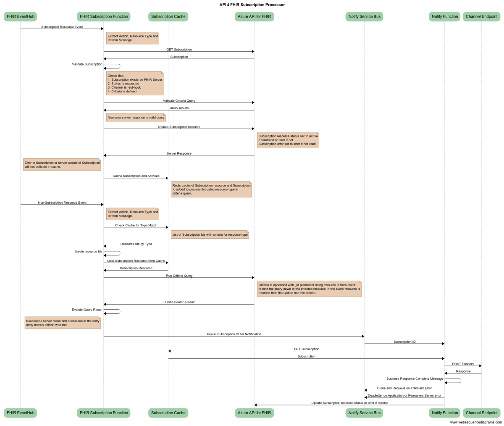

# FHIR Subscription Processor

FHIR Subscription Processor is an Azure Function App solution that provides support for creation and monitor suppport for FHIR R4 Subscription resources:
 + Validates Criteria and Activates Subscription Monitoring 
 + Supports rest-hook callback notifications
 + Complete Auditing, Error logging and Retry for notifications 

# Subscription Process Overview


# Prerequsites
1. The following resources providers must be registered in your subscription and you must have the ability to create/update them:
   + ResourceGroup, KeyVault, Storage Account, App Service Plan, Function App, ServiceBus, EventHub, Azure Cache for Redis
2. You must have the policy assigned to read/write KeyVault Secrets in the speicified keyvault.
3. You must have all resource updates flowing through the [FHIR Proxy](https://github.com/microsoft/fhir-proxy) with the PublishEvents post-processor enabled

# Deployment
1. [Open Azure Cloud Shell](https://shell.azure.com) you can also access this from [Azure Portal](https://portal.azure.com)
2. Select Bash Shell for the environment 
3. Clone this repo ```git clone https://github.com/sordahl-ga/FHIRSubscriptionProcessor```
4. Execute ```deploysubprocessor.bash```
5. Follow prompts.


# Contributing

This project welcomes contributions and suggestions.  Most contributions require you to agree to a
Contributor License Agreement (CLA) declaring that you have the right to, and actually do, grant us
the rights to use your contribution. For details, visit https://cla.opensource.microsoft.com.

When you submit a pull request, a CLA bot will automatically determine whether you need to provide
a CLA and decorate the PR appropriately (e.g., status check, comment). Simply follow the instructions
provided by the bot. You will only need to do this once across all repos using our CLA.

This project has adopted the [Microsoft Open Source Code of Conduct](https://opensource.microsoft.com/codeofconduct/).
For more information see the [Code of Conduct FAQ](https://opensource.microsoft.com/codeofconduct/faq/) or
contact [opencode@microsoft.com](mailto:opencode@microsoft.com) with any additional questions or comments.

FHIR® is the registered trademark of HL7 and is used with the permission of HL7.
