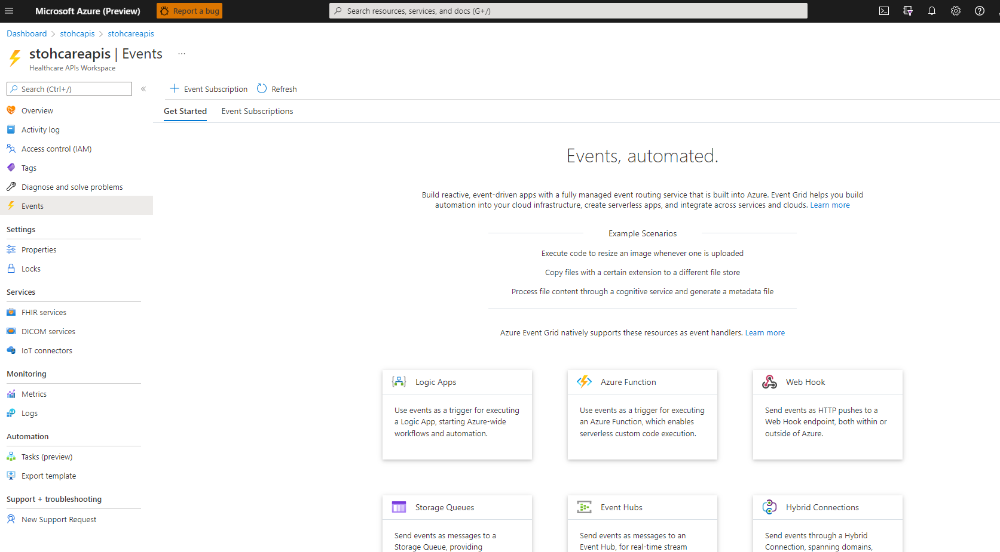
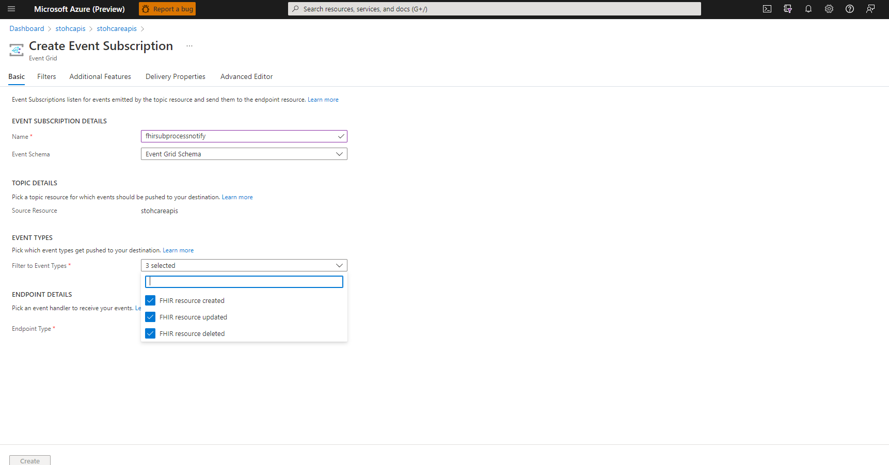

# FHIR Subscription Processor

FHIR Subscription Processor is an Azure Function App solution that provides support for creation and monitoring of [FHIR R4 Subscription resources](https://build.fhir.org/subscription.html) Features include:
 + Validation of Criteria and Activation of Subscription Monitoring upon Subscription Resource Create/Modify 
 + Support for rest-hook callback notifications
 + Complete Auditing, Error logging and Retry for rest-hook notifications 

## Subscription Process Overview


## Prerequsites
1. The following resources providers must be registered in your subscription and you must have the ability to create/update them:
   + ResourceGroup, KeyVault, Storage Account, App Service Plan, Function App, ServiceBus, EventHub, Azure Cache for Redis
2. You must have the policy assigned to read/write KeyVault Secrets in the speicified keyvault.
3. You must have all resource updates using Native Eventing in [Azure Health Data Services](https://docs.microsoft.com/en-us/azure/healthcare-apis/)

## Deployment

### Portal Deployment
To quickly deploy the FHIR Subscription Processor, you can use the Azure deployment button:</br> 
[](https://portal.azure.com/#create/Microsoft.Template/uri/https%3A%2F%2Fraw.githubusercontent.com%2Fsordahl-ga%2FFHIRSubscriptionProcessor%2Fmaster%2Fscripts%2Ffhirsubprocessor.json/createUIDefinitionUri/https%3A%2F%2Fraw.githubusercontent.com%2Fsordahl-ga%2FFHIRSubscriptionProcessor%2Fmaster%2Fscripts%2FcreateUiDefinition.json)

<B>Post Deployment Steps</B>
1. [Access Azure Portal](https://portal.azure.com)
2. Find and Select Your Azure Health Data Services Workspace for your FHIR Server
3. Select the Events section on the left hand navigation window
4. Click on the ```+ Event Subscription``` tab

5. Provide a name for your subscription (e.g. fhirsubprocessnotify) and select all available FHIR Events

6. Select endpoint type of Storage Queue then click select an endpoint, select the storage account installed with the FHIR Subscription Processor function, select exiting queue then select the ```fhirsubprocessorqueue```
7. If you have more than one FHIR Service you can filter to the specified FHIR Service by: Select the filters tab, Check the enable subject filtering, enter the name of your FHIR Service in the Subject begins with filter textbox.  
8. Click the Create Button
9. You may now add Subscription resources and you should start receiving notifications at your defined web-hook endpoint when resources are created/updated that meet criteria in the FHIR Server  

## Simple Use Example
Let's say you want to monitor your severe diabetic population via a population management application.  This population management application exposes a rest-hook endpoint that will trigger a refresh workflow for diabetic patients when called, this workflow may include updating population, reasessing population risk scores, etc... You want to trigger this endpoint when any Patient is directly assigned a diabetic Condition with complications in the FHIR Server. You would execute the following steps to acheive this:</br>
1. Deploy the FHIR Subscription Processor using instructions above.
2. Using Postman or other HTTP Rest Client, Create a Subscription resource to monitor on the FHIR Server. This Subscription will trigger for Conditions created/updated with a Diabetic w/complication code(s):
```
{
    "resourceType": "Subscription",
    "status": "requested",
    "contact": [
        {
            "system": "email",
            "value": "fred@frog.com"
        }
    ],
    "end": "2023-01-01T00:00:00+00:00",
    "reason": "Alert on Diabetes with Complications Diagnosis",
    "criteria": "Condition?code=http://hl7.org/fhir/sid/icd-10|E11.6",
    "channel": {
        "type": "rest-hook",
        "endpoint": "https://mypopulation.management.app/severediabeticpopulationnotify",
        "header":[
           "Authorization: Bearer token1234"
        ]
    }
}
``` 
<I>Note: This is a POST command to the endpoint you can specify any needed access or instruction HTTP headers in the headers field of the channel definition.</I></br></br> 
3. Retrieve the Subscription resource using the logical ID returned and make sure it's status has been switched to active
```
{
    "resourceType": "Subscription",
    "id": "1061ca9e-fa7d-4f95-8054-8c96b31269b3",
    "meta": {
              "versionId": "22",
              "lastUpdated": "2021-05-06T13:23:03.711+00:00"
    },
    "status": "active",
    "contact": [
        {
            "system": "email",
            "value": "fred@frog.com"
        }
    ],
    "end": "2023-01-01T00:00:00+00:00",
    "reason": "Alert on Diabetes with Complications Diagnosis",
    "criteria": "Condition?code=http://hl7.org/fhir/sid/icd-10|E11.6",
    "channel": {
        "type": "rest-hook",
        "endpoint": "https://mypopulation.management.app/severediabeticpopulationnotify",
        "header":[
           "Authorization: Bearer token1234"
        ]
    }
}
```
4. Create a Diabetes w/Complications Condition on a Patient. Example:
```

                "resourceType": "Condition",
                "verificationStatus": {
                    "coding": [
                        {
                            "system": "http://terminology.hl7.org/CodeSystem/condition-ver-status",
                            "code": "confirmed"
                        }
                    ]
                },
                "category": [
                    {
                        "coding": [
                            {
                                "system": "http://snomed.info/sct",
                                "code": "439401001",
                                "display": "Diagnosis"
                            }
                        ]
                    }
                ],
                "code": {
                    "coding": [
                        {
                            "system": "http://hl7.org/fhir/sid/icd-10",
                            "code": "E11.6",
                            "display": "Type 2 diabetes mellitus with other specified complications"
                        }
                    ],
                    "text": "Type 2 diabetes mellitus with other specified complications"
                },
                "subject": {
                    "reference": "Patient/ef3866f6-a344-3ff5-98be-02b311758f46"
                },
                "onsetDateTime": "2022-02-02T00:00:00Z"
                
            }
```
5. The application endpoint you specified in the Subscription will be triggered within a short while of the Condition creation.
</br><I>Note: The application endpoint needs to be reachable from the FHIR Subscription Processor function application. Check your outbound configuration to make sure the call will succeed.</I>
6. The FHIR Subscription processor will automatically retry endpoints with transient failures up to a default 5 times waiting a default 30 seconds between attempts.
7. The FHIR Subscription processor will deadletter failed notifications and mark the Subscription in error resulting from more than 5 retries or permamnent HTTP failures.  
8. You can retrieve the Subscription resource to see errors or use the Application Insights Logs for details of failures.
  
# Contributing

This project welcomes contributions and suggestions.  Most contributions require you to agree to a
Contributor License Agreement (CLA) declaring that you have the right to, and actually do, grant us
the rights to use your contribution. For details, visit https://cla.opensource.microsoft.com.

When you submit a pull request, a CLA bot will automatically determine whether you need to provide
a CLA and decorate the PR appropriately (e.g., status check, comment). Simply follow the instructions
provided by the bot. You will only need to do this once across all repos using our CLA.

This project has adopted the [Microsoft Open Source Code of Conduct](https://opensource.microsoft.com/codeofconduct/).
For more information see the [Code of Conduct FAQ](https://opensource.microsoft.com/codeofconduct/faq/) or
contact [opencode@microsoft.com](mailto:opencode@microsoft.com) with any additional questions or comments.

FHIR® is the registered trademark of HL7 and is used with the permission of HL7.
