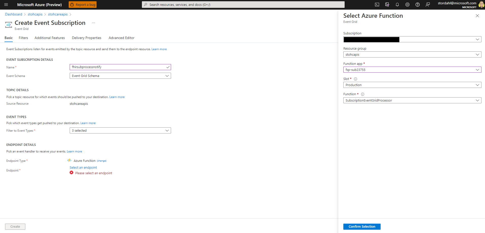

# FHIR Subscription Processor Getting Started with Deploy Scripts
In this document, we go over the deploy scripts necessary for installing FHIR Subscription Processor. We cover the order of script execution and the steps needed to complete the install.

## Errata 
There are no open issues at this time. 

## Prerequisites 

These scripts will gather (and export) information necessary for the proper deployment and configuration of FHIR Subscription Processor. Credentials and other secure information will be stored in the existing Key Vault attached to your FHIR Service/FHIR Proxy deployment or in a newly created keyvault with this deployment.

 - User must have FHIR Server (OSS)/Azure API for FHIR/Azure Healthcare APIs FHIR Service already deployed and set up
 - User must have either native Eventing for Azure HealthcareAPIs or FHIR Proxy eventing module configured for OSS/Azure API for FHIR
 - User must have rights to deploy resources at the Azure Subscription scope (i.e., Contributor role or above).

__Note:__
FHIR Service and FHIR-Proxy use a Key Vault for securing Service Client credentials. Because the ```deploysubprocessor.bash``` script scans the Key Vault for FHIR Service and FHIR-Proxy values, only one Key Vault should be used in your Resource Group. If multiple Key Vaults have been deployed in your Resource Group, please use the [backup and restore](https://docs.microsoft.com/en-us/azure/key-vault/general/backup?tabs=azure-cli) option to copy values to one Key Vault.

__Note:__ 
The FHIR Subscription Processor scripts are designed and tested for the [Azure Cloud Shell - Bash Shell](https://docs.microsoft.com/en-us/azure/cloud-shell/features#:~:text=Azure%20Cloud%20Shell%20is%20a,and%20maintaining%20a%20machine%20yourself.) environment.


### Naming & Tagging
All Azure resource types have a scope in which resource names must be unique. Some resource names, such as PaaS services with public endpoints, have global scopes and therefore must be unique across the entire Azure platform. Our deployment scripts suggest naming standards that group logical connections while aligning with Azure best practices. Users are prompted to accept a default name or supply their own names during installation. See below for the FHIR Subscription Processor resource naming convention.

Resource Type    | Deploy App Name   | Number      | Resource Name Example (automatically generated)
------------|-----------------|-------------|------------------------------------------------
fsp-        | sub            | random      | sfp-sub123456

Azure Resources deployed with this script are automatically tagged with their origin and deployment name (see example below). Users are able to add/change [Tags](https://docs.microsoft.com/en-us/azure/azure-resource-manager/management/tag-resources?tabs=json) after installation.

Origin              |  Deployment       
--------------------|-----------------
HealthArchitectures | FHIRSubscription   

---

## Getting Started
Please note you should deploy these components into a tenant and subscription where you have appropriate permissions to create and manage Application Registrations (ie Application Adminitrator RBAC Role or Global Administrator in AAD), and can deploy Resources at the Subscription Scope. 

Launch Azure Cloud Shell (Bash Environment)

**CTRL+click** (Windows or Linux) or **CMD+click** (Mac) to open in a new window or tab   

[Launch Cloud Shell](https://shell.azure.com/bash?target="_blank")

Clone the repo to your Bash Shell (CLI) environment 
```azurecli-interactive
git clone https://github.com/sordahl-ga/FHIRSubscriptionProcessor 
```
Change working directory to the repo Scripts directory
```azurecli-interactive
cd $HOME/FHIRSubscriptionProcessor/scripts
```

Make the Bash Shell Scripts used for Deployment and Setup executable 
```azurecli-interactive
chmod +x *.bash 
```

## Step 1.  deploysubprocessor.bash
This is the main component deployment script for the FHIR Subscription Processor components and application code.  Note that retry logic is used to account for provisioning delays (e.g., networking provisioning is taking some extra time).  Default retry logic is 5 retries.    

Ensure you are in the proper directory 
```azurecli-interactive
cd $HOME/FHIRSubscriptionProcessor/scripts
``` 

Launch the deploysubprocessor.bash shell script 
```azurecli-interactive
./deploysubprocessor.bash 
``` 

Optionally the deployment script can be used with command line options 
```azurecli
./deploysubprocessor.bash -i <subscriptionId> -g <resourceGroupName> -l <resourceGroupLocation> -n <deployPrefix> -k <keyVaultName> -o <native or proxy>
```


Azure Components installed 
 - Function App with App Insights and Storage 
 - Function App Service plan 
 - ServiceBus Namspace, Topic and Subscription
 - Azure Cache for REDIS
 - Keyvault (if none exist)

Information needed by this script 
 - Subscription
 - Resource Group Name and Location 
 - Keyvault Name 

This script prompts users for the existing Key Vault name, searches for FHIR Service values in the Key Vault, and if found, loads them. Otherwise the script prompts users for the FHIR Service 
 - Client ID
 - Resource 
 - Tenant Name
 - URL 

FHIR Subscription Processor Application Configuration values loaded by this script 

Name                               | Value                      | Located              
-----------------------------------|----------------------------|--------------------
APPINSIGHTS_INSTRUMENTATIONKEY     | GUID                       | App Service Config  
AzureWebJobsStorage                | Endpoint                   | App Service Config 
FUNCTIONS_EXTENSION_VERSION        | Function Version           | App Service Config 
FUNCTIONS_WORKER_RUNTIME           | Function runtime           | App Service Config 
FS-URL                             | FHIR Service URL           | App Service Config  
FS-CLIENT-ID                       | FHIR Service Client ID     | Keyvault reference 
FS-SECRET                          | FHIR Service Client Secret | Keyvault reference 
FS-TENANT-NAME                     | FHIR Service TENANT ID     | Keyvault reference 
FS-RESOURCE                        | FHIR Service Resource ID   | Keyvault reference 
FP-MOD-EVENTHUB-CONNECTION         | Proxy EventHub Connection  | Keyvault reference
FP-MOD-EVENTHUB-NAME               | Proxy EventHub Name        | Keyvault reference 
FSP-NOTIFYSB-CONNECTION            | ServiceBus Connection      | Keyvault reference
FSP-NOTIFYSB-TOPIC                 | ServiceBus Topic           | App Service Config
FSP-NOTIFYSB-SUBSCRIPTION          | ServiceBus Topic Sub       | App Service Config
FSP-REDISCONNECTION				   | Redis Connection			| Keyvault reference
FSP-CONSUMERGROUPNAME			   | Proxy EventHub Consumer Grp| App Service Config

FHIR Subscription Processor Application Configuration values - unique values 

Name                                                | Value  | Used For              
----------------------------------------------------|--------|-----------------------------------
AzureWebJobs.SubscriptionEventHubProcessor.Disabled | 1      | Disabling EventHub When Using Native 
WEBSITE_RUN_FROM_PACKAGE                            | 1      | Optional - sets app to read only


## Step 2. Post Installation

### For Native Eventing (HealthCare APIs EventGrid)
1. [Access Azure Portal](https://portal.azure.com)
2. Find and Select Your Azure Healthcare APIs Workspace for your FHIR Server
3. Select the Events section on the left hand navigation window
4. Click on the ```+ Event Subscription``` tab

5. Provide a name for your subscription (e.g. fhirsubprocessnotify) and select all available FHIR Events

6. Select endpoint type of Azure Function then click select an endpoint, select the FHIR Subscription Processor installation resource group and function app, the Production Slot and the SubscriptionEventGridProcessor function

7. You may now add Subscription resources and you should start receiving notifications at your defined web-hook endpoint when resources are created/updated that meet criteria in the FHIR Server  

### For FHIR Proxy Eventing (PublishEvents Module EventHub)
1. [Access Azure Portal](https://portal.azure.com)
2. Find and Select the Event Hubs Namespace configured from Publish Event Post-Processor module of the [FHIR proxy](https://github.com/microsoft/fhir-proxy/blob/main/docs/configuration.md#publish-event-post-processor)
3. Select the ```fhirevents``` eventhub.

4. Click on the ```+ Consumer group``` tab
5. Enter name ```fhirsubprocess```
6. Click the Create Button

7. You may now add Subscription resources and you should start receiving notifications at your defined web-hook endpoint when resources are created/updated that meet criteria in the FHIR Server  

 

