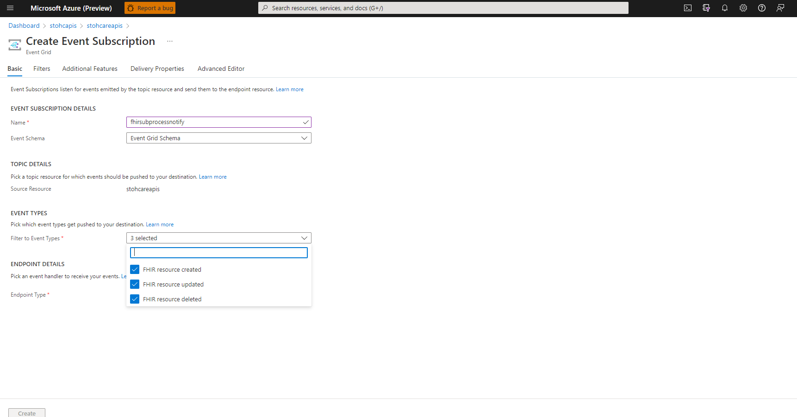
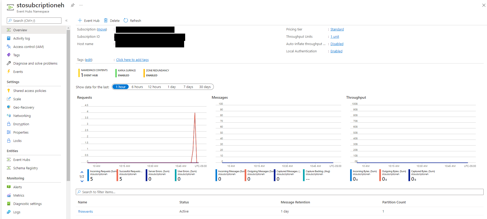
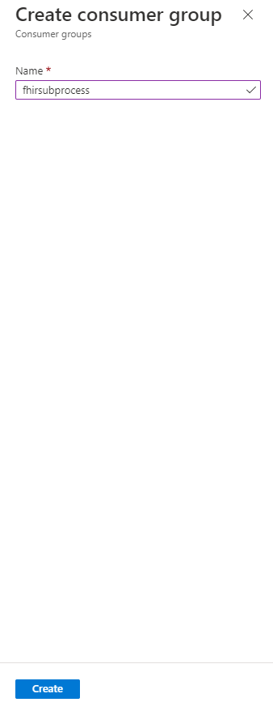

# FHIR Subscription Processor Getting Started with Deploy Scripts
In this document, we go over the deployment steps necessary for installing FHIR Subscription Processor. We cover the order of the steps to be executed, application settings and prerequisites.


## Prerequisites 

These steps will gather (and export) information necessary for the proper deployment and configuration of FHIR Subscription Processor. Credentials and other secure information will be stored in app settings for the FHIR Subscription Processor function app.
Note: It is strongly recommended to use the MSI credentials option for access

 - User must have FHIR Server (OSS)/Azure API for FHIR/Azure Healthcare APIs FHIR Service already deployed and set up
 - User must have either native Eventing for Azure HealthcareAPIs or FHIR Proxy eventing module configured for OSS/Azure API for FHIR
 - User must have rights to deploy resources at the Azure Subscription scope (i.e., Contributor role or above).


### Naming & Tagging
All Azure resource types have a scope in which resource names must be unique. Some resource names, such as PaaS services with public endpoints, have global scopes and therefore must be unique across the entire Azure platform. Our deployment scripts suggest naming standards that group logical connections while aligning with Azure best practices. Users are prompted to accept a default name or supply their own names during installation. See below for the FHIR Subscription Processor resource naming convention.

Resource Type    | Deploy App Name   | Number      | Resource Name Example (automatically generated)
------------|-----------------|-------------|------------------------------------------------
fsp-        | sub            | random      | sfpsub123456

Azure Resources deployed with this script are automatically tagged with their origin and deployment name (see example below). Users are able to add/change [Tags](https://docs.microsoft.com/en-us/azure/azure-resource-manager/management/tag-resources?tabs=json) after installation.

Origin              |  Deployment       
--------------------|-----------------
HealthArchitectures | FHIRSubscription   

---

## Getting Started
Please note you should deploy these components into a tenant and subscription where you have appropriate permissions to create,manage and deploy Resources at the Subscription Scope. 

## Step 1.  Portal Deployment
To quickly deploy the FHIR Subscription Processor, you can use the Azure deployment button:</br> 
[](https://portal.azure.com/#create/Microsoft.Template/uri/https%3A%2F%2Fraw.githubusercontent.com%2Fsordahl-ga%2FFHIRSubscriptionProcessor%2Fmaster%2Fscripts%2Ffhirsubprocessor.json/createUIDefinitionUri/https%3A%2F%2Fraw.githubusercontent.com%2Fsordahl-ga%2FFHIRSubscriptionProcessor%2Fmaster%2Fscripts%2FcreateUiDefinition.json)


Azure Components installed 
 - Function App with App Insights and Storage 
 - Function App Service plan 
 - ServiceBus Namspace, Topic and Subscription
 - Azure Cache for REDIS
 
FHIR Subscription Processor Application Configuration values loaded by this template 

Name                               | Value                      | Located              
-----------------------------------|----------------------------|--------------------
APPINSIGHTS_INSTRUMENTATIONKEY     | GUID                       | App Service Config  
AzureWebJobsStorage                | Endpoint                   | App Service Config 
FUNCTIONS_EXTENSION_VERSION        | Function Version           | App Service Config 
FUNCTIONS_WORKER_RUNTIME           | Function runtime           | App Service Config 
FS-URL                             | FHIR Service URL           | App Service Config  
FS-CLIENT-ID                       | FHIR Service Client ID     | Keyvault reference 
FS-SECRET                          | FHIR Service Client Secret | Keyvault reference 
FS-TENANT-NAME                     | FHIR Service TENANT ID     | Keyvault reference 
FS-RESOURCE                        | FHIR Service Resource ID   | Keyvault reference 
FP-MOD-EVENTHUB-CONNECTION         | Proxy EventHub Connection  | Keyvault reference
FP-MOD-EVENTHUB-NAME               | Proxy EventHub Name        | Keyvault reference 
FSP-NOTIFYSB-CONNECTION            | ServiceBus Connection      | Keyvault reference
FSP-NOTIFYSB-TOPIC                 | ServiceBus Topic           | App Service Config
FSP-NOTIFYSB-SUBSCRIPTION          | ServiceBus Topic Sub       | App Service Config
FSP-REDISCONNECTION				   | Redis Connection			| Keyvault reference
FSP-CONSUMERGROUPNAME			   | Proxy EventHub Consumer Grp| App Service Config

FHIR Subscription Processor Application Configuration values - unique values 

Name                                                | Value  | Used For              
----------------------------------------------------|--------|-----------------------------------
AzureWebJobs.SubscriptionEventHubProcessor.Disabled | 1      | Disabling EventHub When Using Native 
WEBSITE_RUN_FROM_PACKAGE                            | 1      | Optional - sets app to read only


## Step 2. Post Installation

### For Native Eventing (HealthCare Data Services EventGrid)
1. [Access Azure Portal](https://portal.azure.com)
2. Find and Select Your Azure Health Data Services Workspace for your FHIR Server
3. Select the Events section on the left hand navigation window
4. Click on the ```+ Event Subscription``` tab

5. Provide a name for your subscription (e.g. fhirsubprocessnotify) and select all available FHIR Events

6. Select endpoint type of Storage Queue then click select an endpoint, select the storage account installed with the FHIR Subscription Processor function, select exiting queue then select the ```fhirsubprocessorqueue```
7. If you have more than one FHIR Service you can filter to the specified FHIR Service by: Select the filters tab, Check the enable subject filtering, enter the name of your FHIR Service in the Subject begins with filter textbox.  
8. Click the Create Button
9. You may now add Subscription resources and you should start receiving notifications at your defined web-hook endpoint when resources are created/updated that meet criteria in the FHIR Server  

### For FHIR Proxy Eventing (PublishEvents Module EventHub)
1. [Access Azure Portal](https://portal.azure.com)
2. Find and Select the Event Hubs Namespace configured from Publish Event Post-Processor module of the [FHIR proxy](https://github.com/microsoft/fhir-proxy/blob/main/docs/configuration.md#publish-event-post-processor)
3. Select the ```fhirevents``` eventhub.

4. Click on the ```+ Consumer group``` tab
5. Enter name ```fhirsubprocess```
6. Click the Create Button

7. You may now add Subscription resources and you should start receiving notifications at your defined web-hook endpoint when resources are created/updated that meet criteria in the FHIR Server  

 

